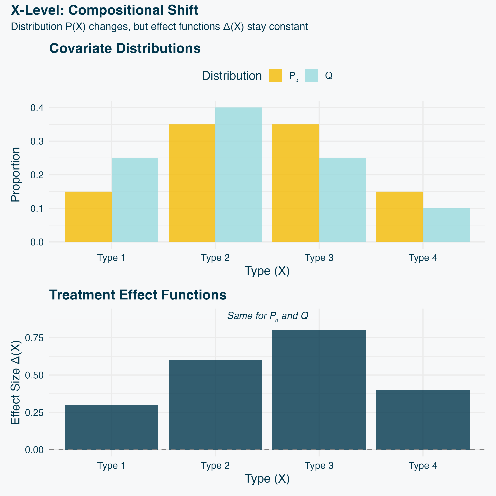
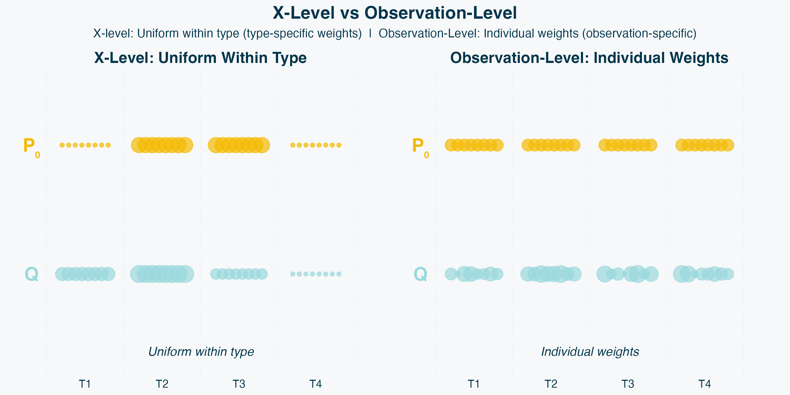

## What is a Surrogate Endpoint? {.smaller}

**Definition:** Surrogate $S$ measured cheaply/abundantly to predict treatment effect on gold-standard outcome $Y$

**Examples:**

| Domain | Surrogate ($S$) | Outcome ($Y$) |
|--------|-----------------|---------------|
| Clinical | CD4 count | AIDS mortality |
| Clinical | Tumor shrinkage | Overall survival |
| PPI/ML | ML prediction | Gold-standard label |
| Observational | Admin claims | Chart review |

::: {.notes}
A surrogate is any measurement that's cheaper, faster, or more abundant than the gold-standard outcome. In clinical trials, that's CD4 count measured in months versus mortality in years. In machine learning and prediction-powered inference, it's an ML prediction from cheap features versus expensive gold-standard labels. In observational studies, it's administrative claims versus chart review, or wearable sensors versus clinical visits. The common thread: we want to use the abundant surrogate S to infer treatment effects on the rare outcome Y.
:::

---

## Why Surrogates Matter {.smaller}

**Applications:**

- **Clinical trials:** Accelerate development, reduce costs, enable early stopping
- **PPI/ML:** Large surrogate dataset + small gold-standard labels
- **Observational:** Admin data abundant, chart review costly

**Universal challenge:** Must work in [**future studies/populations**]{.yellow}, not just where validated

::: {.notes}
Surrogates matter far beyond clinical trials. In prediction-powered inference, we have small gold-standard datasets and large surrogate datasets—ML models predict expensive outcomes from cheap features. In observational studies, administrative data is abundant while chart review is costly. The common thread: we need to know if the surrogate relationship will hold in future studies with different populations, different covariate distributions, different effect heterogeneity. This is fundamentally a question of transportability.
:::

---

## Current Methods 1/3: Mediation & PTE {.smaller}

**Setup:** $(A, S, Y) \sim \mathbb{P}_0$ (observed study)

**Mediation estimands (functionals of $\mathbb{P}_0$):**
$$\text{Total}(\mathbb{P}_0) = \mathbb{E}_{\mathbb{P}_0}[Y(1) - Y(0)] \equiv \Delta_Y(\mathbb{P}_0)$$
$$\text{Indirect}(\mathbb{P}_0) = \mathbb{E}_{\mathbb{P}_0}[Y(1, S(1)) - Y(1, S(0))]$$

**PTE:** Proportion of treatment effect
$$\text{PTE}(\mathbb{P}_0) = \frac{\text{Indirect}(\mathbb{P}_0)}{\text{Total}(\mathbb{P}_0)}$$

If PTE ≈ 1, knowing $\Delta_S$ (surrogate effect) tells you most of the information in $\Delta_Y$ (outcome effect) **in this study**

::: {.blue}
**LIMITATION: Current study estimand**
:::

Functionals of $\mathbb{P}_0$ only — assumes they transport to future studies

::: {.notes}
The standard approach is mediation analysis. We observe A, S, Y from distribution P₀—the current study. The total effect is the expected difference in potential outcomes Y(1) minus Y(0) under P₀. The indirect effect uses nested potential outcomes: Y under treatment but with surrogate set to its value under treatment versus control, again under P₀. PTE—proportion of treatment effect—is the ratio of indirect to total, both functionals of P₀. If PTE is high, most of the effect goes through S in this study. But the critical limitation: these are functionals of P₀ only. They measure how S and Y relate in the current study and assume this relationship transports to future studies. They don't quantify transportability—they assume it.
:::

---

## Current Methods 2/3: Principal Stratification {.smaller}

**Approach:** Define strata in $\mathbb{P}_0$ by potential surrogate values $S(0)$, $S(1)$

- For binary $S$: 4 strata (never-takers, compliers, always-takers, defiers)
- Examine $\Delta_Y$ within each stratum
- Good surrogate: Large $\Delta_Y$ where $S$ responds

::: {.blue}
**LIMITATIONS:**
:::

1. **Current study estimand** — functionals of $\mathbb{P}_0$ (assumes transportability)
2. **Binary/categorical $S$ only** — continuous $S$ intractable without more assumptions

::: {.notes}
Principal stratification defines strata in the observed study P₀ based on potential surrogate values—for binary S, four strata. The idea: if treatment only affects the outcome in strata where it affects the surrogate, that's a good surrogate. But this approach has two critical limitations. First, like mediation, it identifies functionals of P₀—the current study—and assumes they transport. Second, it essentially requires binary or categorical surrogates. With continuous S, you have infinite strata, which is intractable. In practice, you must discretize—CD4 count becomes high versus low—losing information and imposing arbitrary cutpoints. This limits applicability severely.
:::

---

## Current Methods 3/3: Meta-Analysis {.smaller}

**Approach (Buyse et al. 2000):**

- Collect multiple completed studies: $\mathbb{P}_1, \mathbb{P}_2, \ldots, \mathbb{P}_5$
- Compute $\Delta_S(\mathbb{P}_j)$, $\Delta_Y(\mathbb{P}_j)$ in each
- Correlate $\Delta_S$ with $\Delta_Y$ **across studies**

::: {.yellow}
**ADVANTAGE: Future study estimand** ✓
:::

Directly measures variation across realized studies

::: {.blue}
**LIMITATIONS: Requires 5-10+ studies**
:::

::: {.notes}
Meta-analysis offers a fundamentally different approach. Buyse and colleagues collect multiple studies P₁, P₂, through P₅ or more, compute treatment effects in each, and correlate them across studies. This is the gold standard because it directly addresses transportability—it measures variation across realized studies, so if the correlation is high across past studies, it likely holds for future ones. But there's a major practical limitation: you need many completed studies—typically 5 to 10 or more—all measuring both S and Y. This data is often unavailable for new treatments, rare diseases, or novel surrogates. Can we get the advantages of meta-analysis from a single study?
:::

---

## Summary: Method Trade-offs {.smaller}

| Method | Future Study? | Continuous S? | Single Study? |
|--------|---------------|---------------|---------------|
| Mediation/PTE | ✗ | ✓ | ✓ |
| Principal Strat | ✗ | ✗ | ✓ |
| Meta-Analysis | ✓ | ✓ | ✗ |

::: {.yellow}
**What we want: All three checkmarks** ✓✓✓
:::

- Future study estimand (like meta-analysis)
- Works for any $S$ (like mediation)
- Single study (like mediation/PS)

::: {.notes}
Let's step back and compare these approaches. Mediation and PTE measure relationships in the current study, not across future studies. Principal stratification has that same limitation plus it only works for binary or categorical surrogates—continuous surrogates are intractable. Meta-analysis is the gold standard because it directly addresses transportability by examining variation across studies, but it requires many completed studies that are often unavailable. We face a dilemma: single-study methods don't address transportability directly, while meta-analysis requires data we often don't have. What we want is the best of both worlds: a future study estimand like meta-analysis, applicable to any surrogate type like mediation, but working with a single study. Can we achieve this?
:::

---

## Our Approach: Hypothetical Future Studies {.smaller}

**Key idea:** Instead of waiting for realized studies, consider hypothetical futures $\mathcal{Q}$ that differ from observed $\mathbb{P}_0$

**How:**

1. Define distribution of "plausible" future studies
2. Sample $\mathcal{Q}_1, \ldots, \mathcal{Q}_M$ from this distribution
3. Compute $\Delta_S(\mathcal{Q})$, $\Delta_Y(\mathcal{Q})$ for each
4. Estimate $\text{cor}(\Delta_S, \Delta_Y)$ **across** sampled studies

::: {.yellow}
**All three checkmarks:** ✓✓✓
:::

- Future study estimand (hypothetical studies)
- Any surrogate type (general framework)
- Single study

::: {.notes}
Our approach achieves all three desiderata simultaneously. The key idea: instead of waiting for multiple realized studies, we consider a distribution of hypothetical future studies. We sample from this distribution, compute treatment effects in each hypothetical study, and estimate functionals across studies—for example, the correlation between surrogate and outcome effects. This gives us a future study estimand like meta-analysis, works for any surrogate type like mediation, and requires only a single study. It's meta-analysis without waiting for the data.
:::

---

## A Distribution of Future Studies

{width=60%}

**Observed:** $\mathbb{P}_0$ = current study (center)

**Future:** Many $\mathcal{Q}$'s drawn from distribution $\mu$

Each yields: $\Delta_S(\mathcal{Q}) = \mathbb{E}_{\mathcal{Q}}[S(1) - S(0)]$, $\Delta_Y(\mathcal{Q}) = \mathbb{E}_{\mathcal{Q}}[Y(1) - Y(0)]$

::: {.notes}
Here's the key conceptual shift: instead of imagining one specific future study, we consider a distribution over many possible future studies. The current study is P₀. Future studies are different distributions Q—different populations, different settings, different time periods. Each Q yields treatment effects ΔS(Q) and ΔY(Q). We characterize our uncertainty with a distribution μ over possible future studies. This distribution μ encodes what we think is plausible.
:::

---

## General Estimand {.smaller}

**General form:**
$$\Theta(\mu) = \Psi\left(\mathbb{E}_\mu[\phi_1(\mathcal{Q})], \ldots, \mathbb{E}_\mu[\phi_K(\mathcal{Q})]\right)$$

where $\Psi$ is smooth and combines base moments

**Examples:**

- **Correlation**: $\text{cor}_\mu(\Delta_S, \Delta_Y)$ — standard measure of association
- **R-squared**: $R^2_\mu(\Delta_S, \Delta_Y) = \text{cor}_\mu^2(\Delta_S, \Delta_Y)$ — variance explained
- **Mean squared prediction error**: $\mathbb{E}_\mu[(\Delta_Y - \hat{\Delta}_Y)^2]$
  - where $\hat{\Delta}_Y = \alpha + \beta\Delta_S$ (α, β fit across studies)

::: {.notes}
The framework is fully general. We estimate functionals of the distribution μ over future studies. The general form combines base moments—each base moment is an expectation over μ, then we apply some smooth function Ψ. Correlation is the motivating example and our primary focus. R-squared is just the square of correlation—it tells you what proportion of outcome effect variance is explained by the surrogate. Mean squared prediction error measures how well the surrogate predicts the outcome across studies using a linear model. All of these are smooth functionals, so our asymptotic theory applies. And crucially, these are always functionals across studies, never across individuals within a study.
:::

---

## Local Geometries {.smaller}

{width=55%}

*Ball of distributions within distance λ of P₀*

**Local geometry:** $U(\mathbb{P}_0, \lambda; d) = \{\mathcal{Q} : d(\mathcal{Q}, \mathbb{P}_0) \leq \lambda\}$

$\mu = \text{Uniform}(U(\mathbb{P}_0, \lambda; d))$ — all $\mathcal{Q}$'s within distance $\lambda$ equally likely

::: {.notes}
Now, how do we choose the distribution μ? There are several approaches. You could elicit expert opinions about plausible futures, use historical variation if multiple studies exist, or perform sensitivity analysis across multiple μ's. Our approach today—local geometries—provides a conservative, non-informative baseline. We define a ball: all distributions within distance λ of P₀. Then we use the uniform distribution on that ball, treating all directions of deviation equally. This is conservative because it doesn't privilege any particular direction of change. And it's flexible—you can use any distance metric that captures the deviations you care about.
:::

---

## Defining the Local Geometry {.smaller}

**Practical choice:** Restrict to $\mathcal{Q} \ll \mathbb{P}_0$ (absolute continuity)

**What this means:**
- $\mathcal{Q}$ supported on support of $\mathbb{P}_0$
- Future studies differ in **population composition**, not covariate values
- Example: $\mathbb{P}_0$ (30% elderly) → $\mathcal{Q}$ (60% elderly) ✓
- Cannot extrapolate: $\mathbb{P}_0$ (ages 20-80) → $\mathcal{Q}$ (age 90) ✗

**Why this choice?**

1. **Avoids modeling assumptions** for unseen covariate values
2. **Consistent with premise** that $\mathbb{P}_0$ is informative about future
3. **Computationally convenient** via importance weighting

::: {.yellow}
**Not a fundamental restriction** — other geometries possible with more assumptions
:::

::: {.notes}
We choose to restrict to absolute continuity, but this is a practical modeling choice, not a fundamental limitation. Q must be supported on the support of P₀, meaning we consider different population compositions—different weightings of observed covariate values—but not entirely new values we've never observed. Why make this choice? First, it avoids complex modeling assumptions. We don't need to extrapolate treatment effects to covariate values we've never seen. Second, it's consistent with our premise: if the current study P₀ is going to be informative about future studies at all, there must be some kinship or overlap between them. The local geometry construction already assumes this—we're looking near P₀, not in distant regions. Absolute continuity just makes this concrete. Third, it's computationally convenient—we can use importance weighting with density ratios. In principle, you could define other geometries with different assumptions, but this is a sensible default.
:::

---

## The Estimator

**Algorithm:**

1. Sample $\mathcal{Q}_1, \ldots, \mathcal{Q}_M$ from $U(\mathbb{P}_0, \lambda)$ via MCMC
2. For each $\mathcal{Q}_m$, compute $\Delta_S(\mathcal{Q}_m)$, $\Delta_Y(\mathcal{Q}_m)$
   - Importance weights: $w_i = \frac{d\mathcal{Q}_m}{d\mathbb{P}_0}(O_i)$
   - RCTs: Weighted means $\sum w_i Y_i / \sum w_i$
   - Observational: AIPW (doubly-robust) with cross-fitting
3. Estimate: $\hat{\Theta} = \text{cor}\{(\Delta_S(\mathcal{Q}_m), \Delta_Y(\mathcal{Q}_m))\}$

::: {.notes}
The estimator is straightforward: sample many future studies from the geometry, compute treatment effects in each by reweighting observed data using importance weights, then correlate the effects across studies. The importance weights are the density ratios dQₘ/dP₀.
:::

---

## Example: When PTE Misleads {.smaller}

**Scenario:** Treatment-covariate interactions with opposite signs

:::: {.columns}

::: {.column width="45%"}
**Data Generating Process:**

- Treatment affects $S$ and $Y$
- Effect modification by covariate $X$ (e.g., disease severity)
- Opposite-signed interactions:
  - $\Delta_S$ increases with mean($X$)
  - Direct effect on $Y$ decreases with mean($X$)

**Results:**

- **In P₀:** PTE = 0.54 → "Good surrogate!" ✓
- **Across studies:** cor(ΔS, ΔY) = 0.00 → "Won't transport" ✗
:::

::: {.column width="55%"}

:::

::::

::: {.yellow}
**Key insight:** Effect modification in opposite directions → surrogate fails across populations
:::

::: {.notes}
Here's a concrete example where PTE misleads. Imagine treatment effects are modified by patient characteristics—age, disease severity, baseline risk. In the observed study P₀ with average characteristics, we measure PTE of 0.54, suggesting a decent surrogate. Mediation analysis would likely approve it. But the treatment-covariate interactions have opposite signs: the surrogate effect increases with patient severity while the outcome effect decreases. As we sample hypothetical future studies with different population mixes—shown as points colored by average severity—the treatment effects diverge. The correlation across studies is essentially zero. Our geometric approach correctly identifies this fragility. The key insight: when effect modification operates in opposite directions on the surrogate versus outcome, a surrogate that looks good in one population will fail to transport.
:::

---

## Sampling: Hit-and-Run MCMC

**Algorithm:**

1. Start at $\mathcal{Q}_t \in U(\mathbb{P}_0, \lambda)$
2. Draw random direction $v$ (uniform on unit sphere)
3. Sample uniformly along line segment within ball → $\mathcal{Q}_{t+1}$
4. Repeat with burn-in

**Properties:**

- Converges to uniform on convex geometries (TV, Wasserstein balls are convex)
- $M = 100$-500 samples sufficient
- Validated convergence (R-hat ≈ 1.0)

::: {.notes}
To sample uniformly from the geometry, we use hit-and-run MCMC, a standard method for convex bodies. Start at a point, pick a random direction uniformly from the unit sphere, move uniformly along the line segment that stays in the ball. TV and Wasserstein balls are convex, so this converges to uniform. After burn-in, this converges to the uniform distribution. We've validated convergence is essentially perfect with R-hat near 1.
:::

---

## Inference {.smaller}

**Asymptotic result:**
$$\sqrt{n}(\hat{\Theta} - \Theta) \xrightarrow{d} N(0, \sigma^2(\lambda))$$

where $n$ = sample size, $M$ = number of sampled studies

**Two sources of uncertainty:**

1. **Estimation error** (rate $\sqrt{n}$): Finite sample from $\mathbb{P}_0$
2. **MCMC approximation** (rate $\sqrt{M}$): Finite sampled studies

**Two-stage approach:**

- Stage 1: Treatment effects (doubly-robust AIPW)
- Stage 2: Functional delta method

::: {.notes}
Inference uses a two-stage functional delta method. The √n rate comes from estimation error—we estimate treatment effects in each sampled Q from a finite sample of size n from P₀. There's also MCMC approximation error at rate √M from using finite M sampled studies instead of infinite, but this is secondary. First, treatment effects have √n-consistent estimators with known influence functions. For observational studies, we use doubly-robust AIPW with cross-fitting. Second, the correlation functional is Hadamard differentiable, enabling standard functional delta method. The result is √n-consistent with an explicit influence function for variance estimation.
:::

---

## Two Approaches to Geometry {.smaller}

**Key choice:** What space do we define $\mathcal{Q}$ over?

:::: {.columns}

::: {.column width="50%"}
**X-Level** (Compositional)

- $\mathcal{Q}$ over covariate distributions
- Future studies differ in patient covariate mix
- Assumes $\Delta_S(X)$, $\Delta_Y(X)$ constant
- Targets compositional transportability
:::

::: {.column width="50%"}
**Observation-Level** (General)

- $\mathcal{Q}$ over individuals
- Includes within-$X$ variation
- Allows heterogeneous effects within $X$
- Robust but more conservative
:::

::::

::: {.yellow}
**Report both for complementary evidence**
:::

::: {.notes}
Now we need to choose the local geometry. Recall: we define Q over some space within distance λ of P₀. The key question: what space? Two natural approaches emerge. X-level geometry defines Q over covariate distributions—future studies differ in patient mix. This gives clear interpretation for compositional changes, but assumes treatment effect functions transport. Observation-level geometry defines Q over individuals—future studies differ in individual-level composition, including noise. This is robust to unmeasured heterogeneity but more conservative. These provide complementary evidence: X-level tells you about compositional transportability under strong assumptions, observation-level provides a conservative bound even with unmeasured factors. We'll examine both.
:::

---

## X-Level: Details {.smaller}

{width=65%}

**Definition:** $U_X(\mathbb{P}_0, \lambda) = \{\mathcal{Q} \text{ over } X: \text{TV}(\mathcal{Q}_X, \mathbb{P}_{0,X}) \leq \lambda\}$

**Changes:** $P(X)$ | **Constant:** $\Delta_S(X)$, $\Delta_Y(X)$

**Assumptions:** $X$ captures effect modifiers; functions transport

::: {.notes}
X-level geometry reweights across covariate distributions—future studies differ in patient mix but the treatment effect functions stay constant. This requires strong assumptions: X must completely determine effect heterogeneity, and the mechanisms must transport. When X captures key effect modifiers and future studies involve the same biology just with different compositions, this is plausible. With well-chosen X—age, disease severity, relevant biomarkers—often reasonable.
:::

---

## Observation-Level: How It Differs {.smaller}

{width=80%}

**Definition:** $U_{\text{obs}}(\mathbb{P}_0, \lambda) = \{\mathcal{Q} \text{ over individuals}: \text{TV}(\mathcal{Q}, \mathbb{P}_0) \leq \lambda\}$

Treats each observation as unique—includes unmeasured $U$ and idiosyncratic variation $\epsilon_i$

::: {.notes}
Observation-level treats observations as unique and reweights them individually. This allows unmeasured heterogeneity and idiosyncratic variation—fundamentally different from X-level. X-level reweights covariate types, capturing only between-X variation—the signal. Observation-level reweights individual observations, including both signal and within-X noise. This makes observation-level more robust but also conflates signal with noise.
:::

---

## Which Geometry? {.smaller}

| Scenario | Primary | Secondary |
|----------|---------|-----------|
| Well-chosen $X$ | X-Level | Obs-Level (check) |
| Uncertain $X$ | Obs-Level | X-Level (supplement) |
| Unmeasured $U$ | Obs-Level | - |

**Comparing the two:**
- X-level typically gives higher correlation (assumes functions transport)
- Obs-level more conservative (includes noise)
- Gap indicates importance of unmeasured heterogeneity

::: {.notes}
Which should you use? Ideally, both. X-level gives higher correlation under strong assumptions—mechanisms transport, X captures heterogeneity. Observation-level is more robust but conservative, including noise that may not matter for large-sample transportability. The gap between them indicates the importance of unmeasured heterogeneity and idiosyncratic variation. If they're similar, robust conclusion. If very different, the noise matters and the choice depends on your application.
:::

---

## How to Use in Practice {.smaller}

**Workflow:**

1. Choose metric $d$ — TV (total variation), Wasserstein (optimal transport), ...
2. For $\lambda = 0.05, 0.10, 0.15, 0.20$:
   - Sample $M \approx 100$-500 studies
   - Compute $\hat{\Theta}(\lambda) = \text{cor}(\Delta_S, \Delta_Y)$
   - Get 95% CI (influence function-based)
3. Plot $\hat{\Theta}(\lambda)$ vs $\lambda$

**Interpretation:**

- Flat line → robust surrogate
- Steep decline → fragile surrogate

**Software:** R package in development

::: {.notes}
In practice, fit the model over a range of λ values—0.05, 0.10, 0.15, 0.20. For each, sample future studies, compute correlations, get confidence intervals. Then plot correlation versus λ. A flat line means the surrogate is robust—it works even for fairly dissimilar studies. A steep decline means it's fragile—only works for studies very close to P₀. Approve the surrogate if correlation stays high over a meaningful range.
:::

---

## Summary

**Key contributions:**

1. Reframing surrogate evaluation as a fundamentally future-looking project
2. Providing a method of estimating cross-study surrogate transportability from a single study
3. Two methods for deriving future studies with different properties

::: {.yellow}
We [**evaluate**]{.yellow} transportability, not [**assume**]{.yellow} it
:::

::: {.notes}
To summarize: we've introduced a general framework for evaluating surrogate transportability using local geometric analysis. X-level analysis assumes compositional changes and recovers high correlation. Observation-level is more general and robust but shows lower correlation due to noise attenuation. The gap between them quantifies the importance of unmeasured heterogeneity. Report both analyses to provide complementary evidence about surrogate quality.
:::

---

## Thanks!

dagniel@rand.org
