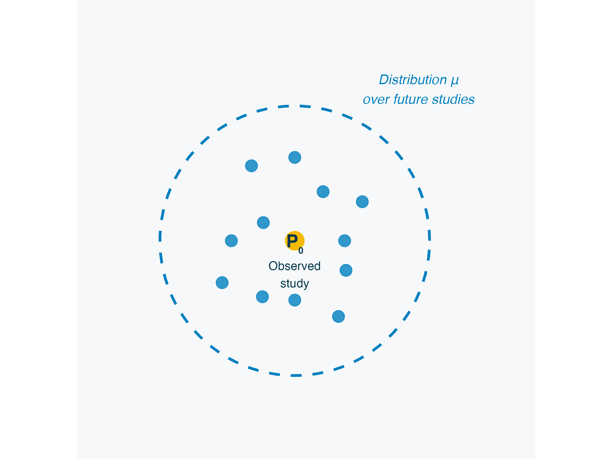
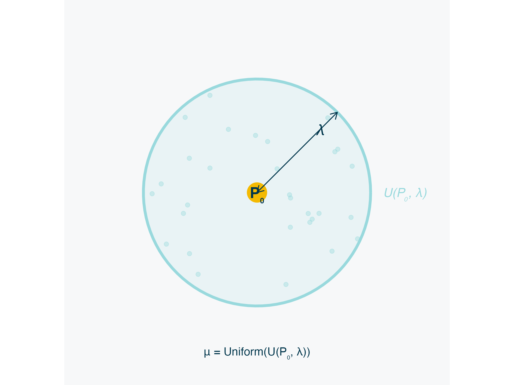
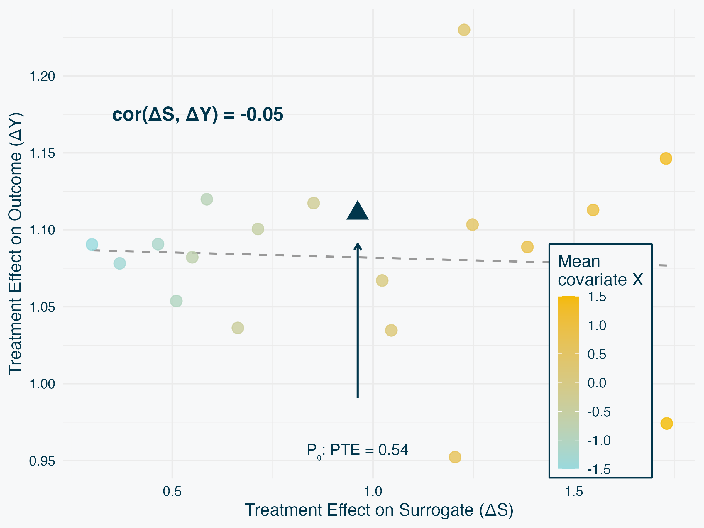
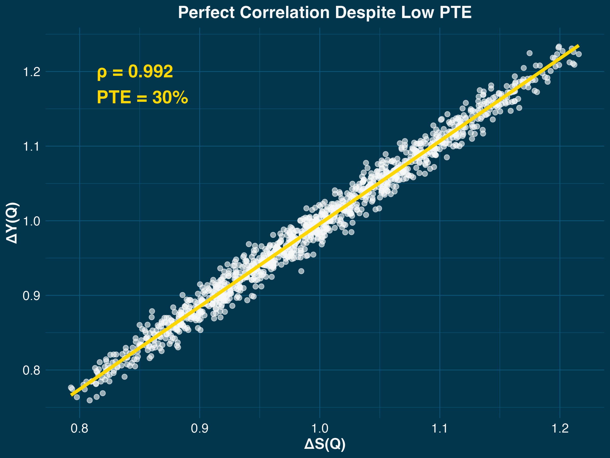
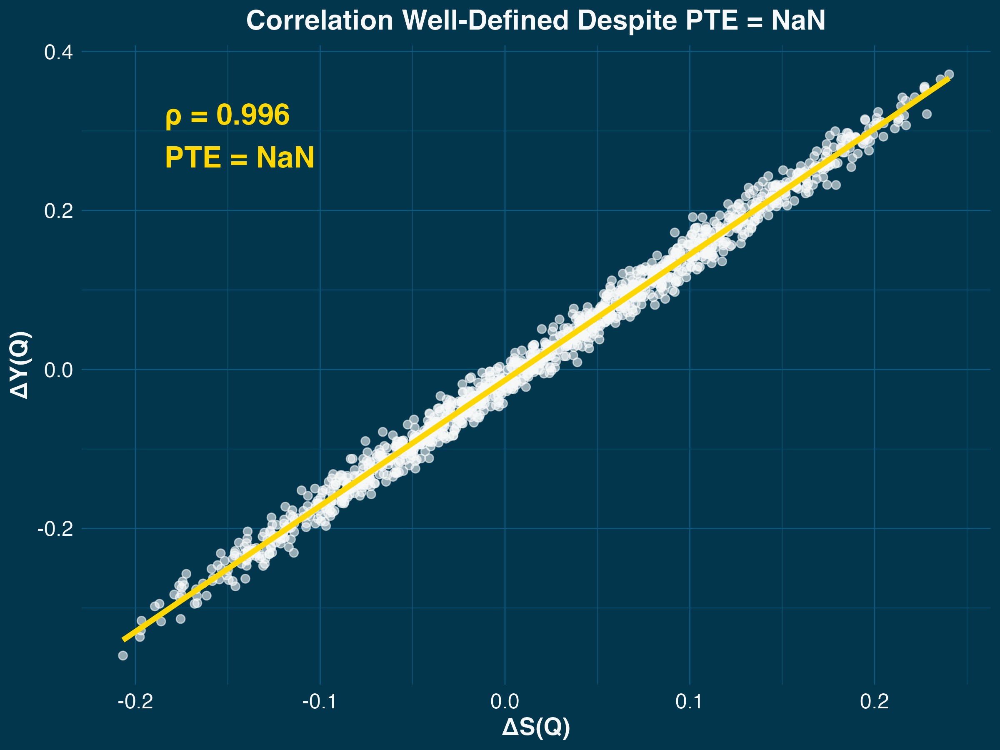

## What is a Surrogate Endpoint? {.smaller}

**Definition:** Surrogate $S$ measured cheaply/abundantly to predict treatment effect on gold-standard outcome $Y$

**Examples:**

| Domain | Surrogate ($S$) | Outcome ($Y$) |
|--------|-----------------|---------------|
| Clinical | CD4 count | AIDS mortality |
| Clinical | Tumor shrinkage | Overall survival |
| PPI/ML | ML prediction | Gold-standard label |
| Observational | Admin claims | Chart review |

**Universal challenge:** Must work in [**future studies/populations**]{.yellow}, not just where validated

::: {.notes}
A surrogate is any measurement that's cheaper, faster, or more abundant than the gold-standard outcome. In clinical trials, that's CD4 count measured in months versus mortality in years. In machine learning and prediction-powered inference, it's an ML prediction from cheap features versus expensive gold-standard labels. In observational studies, it's administrative claims versus chart review, or wearable sensors versus clinical visits. The common thread: we want to use the abundant surrogate S to infer treatment effects on the rare outcome Y.
:::

---

## Current Methods 1/3: Mediation & PTE {.smaller}

**Setup:** $(A, S, Y) \sim \mathbb{P}_0$ (observed study)

**Mediation estimands (functionals of $\mathbb{P}_0$):**
$$\text{Total}(\mathbb{P}_0) = \mathbb{E}_{\mathbb{P}_0}[Y(1) - Y(0)] \equiv \Delta_Y(\mathbb{P}_0)$$
$$\text{Indirect}(\mathbb{P}_0) = \mathbb{E}_{\mathbb{P}_0}[Y(1, S(1)) - Y(1, S(0))]$$

**PTE:** Proportion of treatment effect
$$\text{PTE}(\mathbb{P}_0) = \frac{\text{Indirect}(\mathbb{P}_0)}{\text{Total}(\mathbb{P}_0)}$$

::: {.blue}
**LIMITATION: Current study estimand: functionals of $\mathbb{P}_0$ only**
:::

::: {.notes}
The standard approach is mediation analysis. We observe A, S, Y from distribution P₀—the current study. The total effect is the expected difference in potential outcomes Y(1) minus Y(0) under P₀. The indirect effect uses nested potential outcomes: Y under treatment but with surrogate set to its value under treatment versus control, again under P₀. PTE—proportion of treatment effect—is the ratio of indirect to total, both functionals of P₀. If PTE is high, most of the effect goes through S in this study. But the critical limitation: these are functionals of P₀ only. They measure how S and Y relate in the current study and assume this relationship transports to future studies. They don't quantify transportability—they assume it.
:::

---

## Current Methods 2/3: Principal Stratification {.smaller}

**Approach:** Define strata in $\mathbb{P}_0$ by potential surrogate values $S(0)$, $S(1)$

- For binary $S$: 4 strata (e.g., S(0) = 0, S(1) = 1)
- Examine $\Delta_Y$ within each stratum
- Good surrogate: Large $\Delta_Y$ in strata where $S$ changes (i.e., $S(1) \neq S(0)$)

::: {.blue}
**LIMITATIONS: Current study estimand and continuous $S$ difficult**
:::

::: {.notes}
Principal stratification defines strata in the observed study P₀ based on potential surrogate values—for binary S, four strata. The idea: if treatment only affects the outcome in strata where it affects the surrogate, that's a good surrogate. But this approach has two critical limitations. First, like mediation, it identifies functionals of P₀—the current study—and assumes they transport. Second, it essentially requires binary or categorical surrogates. With continuous S, you have infinite strata, which is intractable. In practice, you must discretize—CD4 count becomes high versus low—losing information and imposing arbitrary cutpoints. This limits applicability severely.
:::

---

## Current Methods 3/3: Meta-Analysis {.smaller}

**Approach:**

- Collect multiple completed studies: $\mathbb{P}_1, \mathbb{P}_2, \ldots, \mathbb{P}_5$
- Compute $\Delta_S(\mathbb{P}_j)$, $\Delta_Y(\mathbb{P}_j)$ in each
- Correlate $\Delta_S$ with $\Delta_Y$ **across studies**

::: {.yellow}
**ADVANTAGE: Future study estimand** ✓
:::

::: {.blue}
**LIMITATIONS: Requires 5-10+ studies**
:::

::: {.notes}
Meta-analysis offers a fundamentally different approach. Buyse and colleagues collect multiple studies P₁, P₂, through P₅ or more, compute treatment effects in each, and correlate them across studies. This is the gold standard because it directly addresses transportability—it measures variation across realized studies, so if the correlation is high across past studies, it likely holds for future ones. But there's a major practical limitation: you need many completed studies—typically 5 to 10 or more—all measuring both S and Y. This data is often unavailable for new treatments, rare diseases, or novel surrogates. Can we get the advantages of meta-analysis from a single study?
:::

---

## Summary: Method Trade-offs {.smaller}

| Method | Future Study? | Continuous S? | Single Study? |
|:----------------------|:-------------:|:-------------:|:-------------:|
| Mediation/PTE | ✗ | ✓ | ✓ |
| Principal Stratification | ✗ | ✗ | ✓ |
| Meta-Analysis | ✓ | ✓ | ✗ |

::: {.yellow}
**What we want: All three checkmarks** ✓✓✓
:::

- Future study estimand (like meta-analysis)
- Works for any $S$ (like mediation/meta-)
- Single study (like mediation/PS)

::: {.notes}
Let's step back and compare these approaches. Mediation and PTE measure relationships in the current study, not across future studies. Principal stratification has that same limitation plus it only works for binary or categorical surrogates—continuous surrogates are intractable. Meta-analysis is the gold standard because it directly addresses transportability by examining variation across studies, but it requires many completed studies that are often unavailable. We face a dilemma: single-study methods don't address transportability directly, while meta-analysis requires data we often don't have. What we want is the best of both worlds: a future study estimand like meta-analysis, applicable to any surrogate type like mediation, but working with a single study. Can we achieve this?
:::

---

## Our Approach: Hypothetical Future Studies {.smaller}

**Key idea:** Instead of waiting for realized studies, consider hypothetical futures $\mathcal{Q}$ that differ from observed $\mathbb{P}_0$

**How:**

1. Define [distribution of "plausible" future studies]{.yellow}
2. Sample $\mathcal{Q}_1, \ldots, \mathcal{Q}_M$ from this distribution
3. Compute $\Delta_S(\mathcal{Q})$, $\Delta_Y(\mathcal{Q})$ for each
4. Estimate $\text{cor}(\Delta_S, \Delta_Y)$ (or some other functional) **across** sampled studies

::: {.yellow}
**All three checkmarks:** ✓✓✓
:::

- Future study estimand (hypothetical studies)
- Any surrogate type (general framework)
- Single study

::: {.notes}
Our approach achieves all three desiderata simultaneously. The key idea: instead of waiting for multiple realized studies, we consider a distribution of hypothetical future studies. We sample from this distribution, compute treatment effects in each hypothetical study, and estimate functionals across studies—for example, the correlation between surrogate and outcome effects. This gives us a future study estimand like meta-analysis, works for any surrogate type like mediation, and requires only a single study. It's meta-analysis without waiting for the data.
:::

---

## A Distribution of Future Studies

{width=60%}

**Observed:** $\mathbb{P}_0$ = current study (center)

**Future:** Many $\mathcal{Q}$'s drawn from distribution $\mu$

Each yields: $\Delta_S(\mathcal{Q}) = \mathbb{E}_{\mathcal{Q}}[S(1) - S(0)]$, $\Delta_Y(\mathcal{Q}) = \mathbb{E}_{\mathcal{Q}}[Y(1) - Y(0)]$

::: {.notes}
Here's the key conceptual shift: instead of imagining one specific future study, we consider a distribution over many possible future studies. The current study is P₀. Future studies are different distributions Q—different populations, different settings, different time periods. Each Q yields treatment effects ΔS(Q) and ΔY(Q). We characterize our uncertainty with a distribution μ over possible future studies. This distribution μ encodes what we think is plausible.
:::

---

## General Estimand {.smaller}

**General form:**
$$\Theta(\mu) = \Psi\left(\mathbb{E}_\mu[\phi_1(\mathcal{Q})], \ldots, \mathbb{E}_\mu[\phi_K(\mathcal{Q})]\right)$$

where $\Psi$ is smooth and combines base moments

**Examples:**

- **Correlation**: $\text{cor}_\mu(\Delta_S, \Delta_Y)$ — standard measure of association
- **R-squared**: $R^2_\mu(\Delta_S, \Delta_Y) = \text{cor}_\mu^2(\Delta_S, \Delta_Y)$ — variance explained
- **Mean squared prediction error**: $\mathbb{E}_\mu[(\Delta_Y - \hat{\Delta}_Y)^2]$
  - where $\hat{\Delta}_Y = \alpha + \beta\Delta_S$ (α, β fit across studies)

::: {.notes}
The framework is fully general. We estimate functionals of the distribution μ over future studies. The general form combines base moments—each base moment is an expectation over μ, then we apply some smooth function Ψ. Correlation is the motivating example and our primary focus. R-squared is just the square of correlation—it tells you what proportion of outcome effect variance is explained by the surrogate. Mean squared prediction error measures how well the surrogate predicts the outcome across studies using a linear model. All of these are smooth functionals, so our asymptotic theory applies. And crucially, these are always functionals across studies, never across individuals within a study.
:::

---

## Local Geometries {.smaller}

{width=55%}

*Ball of radius [**λ**]{.yellow} containing distributions within distance λ of P₀*

**Local geometry:** $U(\mathbb{P}_0, \lambda; d) = \{\mathcal{Q} : d(\mathcal{Q}, \mathbb{P}_0) \leq \lambda\}$

$\mu = \text{Uniform}(U(\mathbb{P}_0, \lambda; d))$ — all $\mathcal{Q}$'s within distance $\lambda$ equally likely

**Key parameter:** [**λ**]{.yellow} controls how different future studies $Q$ can be from observed study $\mathbb{P}_0$

::: {.notes}
Now, how do we choose the distribution μ? There are several approaches. You could elicit expert opinions about plausible futures, use historical variation if multiple studies exist, or perform sensitivity analysis across multiple μ's. Our approach today—local geometries—provides a conservative, non-informative baseline. We define a ball: all distributions within distance λ of P₀. Then we use the uniform distribution on that ball, treating all directions of deviation equally. This is conservative because it doesn't privilege any particular direction of change. And it's flexible—you can use any distance metric that captures the deviations you care about.
:::

---

## The Method: Step by Step {.smaller}

**How it works:**

1. [**Fix distance λ**]{.yellow} — How far from $\mathbb{P}_0$ should we look?
2. [**Sample $\mathcal{Q}$'s from ball**]{.yellow} — Generate M hypothetical future studies
3. [**Compute effects in each $\mathcal{Q}$**]{.yellow} — Reweight observed data to get ΔS(Q), ΔY(Q)
4. [**Estimate correlation**]{.yellow} — Across sampled Q's: cor(ΔS, ΔY)
5. [**Report with uncertainty**]{.yellow} — 95% CI via influence function

::: {.notes}
Let me make the method concrete. First, we fix a distance λ—this is how far from the observed study we're willing to look. Smaller λ means only very similar studies; larger λ includes more diverse futures. Second, we sample many hypothetical studies Q from the ball—typically 100 to 500 via MCMC. Third, for each sampled Q, we compute treatment effects by reweighting the observed data using importance weights. Fourth, we estimate the correlation across these sampled studies. Fifth, we report the estimate with a confidence interval using the influence function. In practice, we repeat this for multiple λ values to see how correlation changes with distance—flat line means robust, steep decline means fragile.
:::

---

## Defining the Local Geometry {.smaller}

**Practical choice:** Restrict to $\mathcal{Q} \ll \mathbb{P}_0$ (absolute continuity)

**What this means:**

- $\mathcal{Q}$ supported on support of $\mathbb{P}_0$
- Future studies differ in **population composition**, not covariate values
- Example: $\mathbb{P}_0$ (30% elderly) → $\mathcal{Q}$ (60% elderly) ✓
- Cannot extrapolate: $\mathbb{P}_0$ (ages 20-80) → $\mathcal{Q}$ (age 90) ✗

**Why this choice?**

1. **Avoids modeling assumptions** for unseen covariate values
2. **Consistent with premise** that $\mathbb{P}_0$ is informative about future
3. **Computationally convenient** via importance weighting

::: {.yellow}
**Not a fundamental restriction** — other geometries possible with more assumptions
:::

::: {.notes}
We choose to restrict to absolute continuity, but this is a practical modeling choice, not a fundamental limitation. Q must be supported on the support of P₀, meaning we consider different population compositions—different weightings of observed covariate values—but not entirely new values we've never observed. Why make this choice? First, it avoids complex modeling assumptions. We don't need to extrapolate treatment effects to covariate values we've never seen. Second, it's consistent with our premise: if the current study P₀ is going to be informative about future studies at all, there must be some kinship or overlap between them. The local geometry construction already assumes this—we're looking near P₀, not in distant regions. Absolute continuity just makes this concrete. Third, it's computationally convenient—we can use importance weighting with density ratios. In principle, you could define other geometries with different assumptions, but this is a sensible default.
:::

---

## The Estimator

**Algorithm:**

1. Sample $\mathcal{Q}_1, \ldots, \mathcal{Q}_M$ from $U(\mathbb{P}_0, \lambda)$ via MCMC
2. For each $\mathcal{Q}_m$, compute $\Delta_S(\mathcal{Q}_m)$, $\Delta_Y(\mathcal{Q}_m)$
   - Importance weights: $w_i = \frac{d\mathcal{Q}_m}{d\mathbb{P}_0}(O_i)$
   - RCTs: Weighted means $\sum w_i Y_i / \sum w_i$
   - Observational: AIPW (doubly-robust) with cross-fitting
3. Estimate: $\hat{\Theta} = \text{cor}\{(\Delta_S(\mathcal{Q}_m), \Delta_Y(\mathcal{Q}_m))\}$

::: {.notes}
The estimator is straightforward: sample many future studies from the geometry, compute treatment effects in each by reweighting observed data using importance weights, then correlate the effects across studies. The importance weights are the density ratios dQₘ/dP₀.
:::

---

## Example: When PTE Misleads {.smaller}

**Scenario:** Treatment-covariate interactions with opposite signs

:::: {.columns}

::: {.column width="45%"}
**Data Generating Process:**

- Treatment affects $S$ and $Y$
- Effect modification by covariate $X$ (e.g., disease severity)
- Opposite-signed interactions:
  - $\Delta_S$ increases with mean($X$)
  - Direct effect on $Y$ decreases with mean($X$)

**Results:**

- **In P₀:** PTE = 0.54 → "Good surrogate!" ✓
- **Across studies:** cor(ΔS, ΔY) = 0.00 → "Won't transport" ✗
:::

::: {.column width="55%"}

:::

::::

::: {.yellow}
**Key insight:** Effect modification in opposite directions → surrogate fails across populations

**This demonstrates the method works:** Correctly identifies surrogate failure where PTE misleads
:::

::: {.notes}
Here's a concrete example where PTE misleads. Imagine treatment effects are modified by patient characteristics—age, disease severity, baseline risk. In the observed study P₀ with average characteristics, we measure PTE of 0.54, suggesting a decent surrogate. Mediation analysis would likely approve it. But the treatment-covariate interactions have opposite signs: the surrogate effect increases with patient severity while the outcome effect decreases. As we sample hypothetical future studies with different population mixes—shown as points colored by average severity—the treatment effects diverge. The correlation across studies is essentially zero. Our geometric approach correctly identifies this fragility. The key insight: when effect modification operates in opposite directions on the surrogate versus outcome, a surrogate that looks good in one population will fail to transport.
:::

---

## Inference {.smaller}

**Asymptotic result:**
$$\sqrt{n}(\hat{\Theta} - \Theta) \xrightarrow{d} N(0, \sigma^2(\lambda))$$

where $n$ = sample size

**Two sources of uncertainty:**

1. **Estimation error** (rate $\sqrt{n}$): Finite sample from $\mathbb{P}_0$
2. **MCMC approximation** (rate $\sqrt{M}$): Finite sampled studies

**Two-stage approach:**

- Stage 1: Treatment effects (doubly-robust AIPW)
- Stage 2: Functional delta method
- Requires some management of EIF across generated future studies

::: {.notes}
Inference uses a two-stage functional delta method. The √n rate comes from estimation error—we estimate treatment effects in each sampled Q from a finite sample of size n from P₀. There's also MCMC approximation error at rate √M from using finite M sampled studies instead of infinite, but this is secondary. First, treatment effects have √n-consistent estimators with known influence functions. For observational studies, we use doubly-robust AIPW with cross-fitting. Second, the correlation functional is Hadamard differentiable, enabling standard functional delta method. The result is √n-consistent with an explicit influence function for variance estimation.
:::

---

## Validation {.smaller}

**Simulation Design:**

- **N = 10,000** per replication
- **M ≈ 2,100** sampled future studies (adaptive convergence)
- **1,000 replications** per DGP
- **λ = 0.3** (TV ball radius)

**DGP Structure (all 4 scenarios):**

- Single categorical covariate: $X \in \{-2, -1, 0, 1, 2\}$
- Linear effects: $S = (\gamma_A + \gamma_{AX} X) A + \epsilon_S$, $Y = (\beta_A + \beta_{AX} X) A + \beta_S S + \beta_{SX} SX + \epsilon_Y$
- Vary parameters to create different correlation/PTE patterns

**Purpose:** Validate asymptotic theory with high-quality estimates

::: {.notes}
We ran a large-scale simulation with four carefully designed data-generating processes. All four DGPs share the same basic structure: a single five-level categorical covariate X, and linear models for both surrogate and outcome. Effects are linear in X with treatment-covariate interactions. We vary the parameters—mediation strength, interaction signs, baseline effects—to create scenarios with different correlation and PTE patterns. Sample size of 10,000 is larger than typical practice—this is deliberate. We want to focus on bias, not variance, to show the theory works. We sample around 2,100 hypothetical future studies via adaptive MCMC. One thousand replications per scenario gives precise coverage estimates. Lambda of 0.3 means we're looking at studies that differ moderately from the observed study in population composition.
:::

---

## Validation: DGPs 1-2 {.smaller}

**DGP 1:** High mediation (PTE = 82%), moderate positive correlation (ρ = 0.69)

**DGP 2:** Moderate mediation (PTE = 53%), strong negative correlation (ρ = -0.88)

::: {.yellow}
**Both methods work as expected** ✓

- Correct coverage (93-95%)
- Standard errors calibrated
:::

::::

::: {.notes}
DGPs 1 and 2 are our baseline cases where correlation and PTE broadly agree. DGP 1 has high mediation and moderate positive correlation. DGP 2 has opposite effect modification creating strong negative correlation with moderate mediation. In both cases, our method produces unbiased estimates with correct 95 percent coverage. These validate the asymptotic theory works as expected. Now let's look at the interesting cases where PTE misleads or fails.
:::

---

## DGP 3: When Low PTE Hides Perfect Transportability {.smaller}

:::: {.columns}

::: {.column width="45%"}
**Setup:**

- Weak mediation: β_S = 0.3
- Strong direct effect: β_A = 0.7
- Both τ_S(X) and τ_Y(X) scale linearly with X

**PTE says:** 30% mediation → "Weak surrogate" ✗

**Correlation says:** ρ ≈ 1.0 → "Perfect transportability" ✓

::: {.yellow}
**Key insight:** Low PTE ≠ poor surrogate

Effects transport together despite weak mediation
:::

**Simulation:** Bias < 0.001, Coverage = 99.8%
:::

::: {.column width="55%"}

:::

::::

::: {.notes}
DGP 4 shows a critical case where PTE is misleading. There's weak mediation—only 30 percent of the treatment effect goes through the surrogate. Traditional mediation analysis would call this a poor surrogate. But look at the scatter plot: correlation across studies is essentially 1.0. Both surrogate and outcome effects scale linearly with patient characteristics. When the population composition changes, both effects change proportionally. The surrogate transports perfectly despite low mediation. Our simulation confirms this: bias under 0.001, coverage 99.8 percent. The takeaway: low PTE doesn't mean poor transportability if effects co-vary across populations.
:::

---

## DGP 4: When PTE Fails but Correlation Works {.smaller}

:::: {.columns}

::: {.column width="45%"}
**Setup:**

- Antisymmetric treatment effects
- Symmetric reference distribution P₀
- ΔY(P₀) ≈ 0 by symmetry

**PTE:** Division by ≈0 → **Undefined** ✗

**Correlation:** ρ ≈ 1.0 → **Well-defined, perfect** ✓

::: {.yellow}
**Key insight:** Correlation handles edge cases PTE cannot

Robustly evaluates transportability even when traditional methods fail
:::

**Simulation:** Bias < 0.001, Coverage = 99.9%
:::

::: {.column width="55%"}

:::

::::

::: {.notes}
DGP 5 shows an even more dramatic failure of PTE. We have antisymmetric treatment effects—they're positive for some patients, negative for others. The reference study P₀ has a symmetric population distribution, so by symmetry, the average treatment effect ΔY is essentially zero. PTE has division by approximately zero—it's mathematically undefined. You cannot compute it. But correlation across studies is perfectly well-defined and essentially 1.0. Effects co-vary across populations. Simulation confirms: our method gives unbiased estimates with 99.9 percent coverage. The message: correlation-based evaluation is robust. It works even in edge cases where traditional mediation analysis completely fails.
:::

---

## Future Directions {.smaller}

**Methodological extensions:**

1. **Different functionals**
   - R² (variance explained), prediction error
   - Non-smooth functionals

2. **Allowing extrapolation** — Relax absolute continuity ($\mathcal{Q} \ll \mathbb{P}_0$)
   - Extrapolate to new covariate values not observed in current study
   - Requires stronger modeling assumptions

3. **Selecting λ**
   - Tools to understand what $\lambda$ means

4. **Different parts of the ball** 
   - Focus on specific regions (e.g., known future populations)
   - Donut-shaped regions?

::: {.notes}
Several promising directions for future work. First, different functionals beyond correlation. R-squared measures variance explained, prediction error quantifies forecast accuracy, conditional functionals can target specific subpopulations. The framework handles any smooth functional. Second, allowing extrapolation beyond observed covariate values. Currently we restrict to absolute continuity—future studies reweight observed values. Relaxing this allows true extrapolation but requires stronger modeling assumptions about how effects behave in unobserved regions. Third, selecting lambda. Right now we examine multiple values and report sensitivity. We could develop data-driven selection procedures or formal decision rules based on the application. Fourth, non-uniform weights within the ball. Currently we use uniform distribution—all directions equally plausible. We could weight by expert knowledge, historical data, or focus on specific known future populations. These extensions would make the framework even more flexible and applicable.
:::

---

## Summary

**Key contributions:**

- Reframing surrogate evaluation as a fundamentally future-looking project
- Providing a method of estimating cross-study surrogate transportability from a single study

::: {.notes}
To summarize: we've introduced a general framework for evaluating surrogate transportability using local geometric analysis. X-level analysis assumes compositional changes and recovers high correlation. Observation-level is more general and robust but shows lower correlation due to noise attenuation. The gap between them quantifies the importance of unmeasured heterogeneity. Report both analyses to provide complementary evidence about surrogate quality.
:::

---

## Thanks!

dagniel@rand.org
